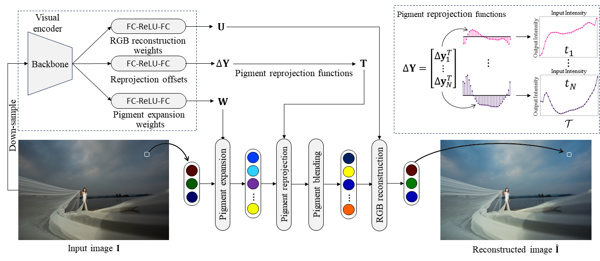

# Image Enhancement Based on Pigment Representation


Se-Ho Lee, Keunsoo Ko, Seung-Wook Kim




## Introduction
We present a novel and efficient image enhancement method based on pigment representation. Unlike conventional methods where the color transformation is restricted to pre-defined color spaces like RGB, our method dynamically adapts to input content by transforming RGB colors into a high-dimensional feature space referred to as pigments. The proposed pigment representation offers adaptability and expressiveness, achieving superior image enhancement performance. The proposed method involves transforming input RGB colors into high-dimensional pigments, which are then reprojected individually and blended to refine and aggregate the information of the colors in pigment spaces. Those pigments are then transformed back into RGB colors to generate an enhanced output image. The transformation and reprojection parameters are derived from the visual encoder which adaptively estimates such parameters based on the content in the input image. Extensive experimental results demonstrate the superior performance of the proposed method over state-of-the-art methods in image enhancement tasks, including image retouching and tone mapping, while maintaining relatively low computational complexity and small model size.

## Environment

The experiments were conducted using the following software environment:

- **PyTorch**: 1.12
- **Torchvision**: 0.13.0  
- **CUDA**: 11.3  
- **Python**: 3.8
- **OS**: Ubuntu 20.04 LTS

## Dataset

The following datasets were used in this project:

- **PPR10K**: [Download Link](https://example.com/ppr10k)
- **Adobe5K**: [Download Link](https://example.com/adobe5k)

After downloading, please place the datasets in the following directories:

- `PPR10K` dataset should be located at:
```  
../data/train_val_images_tif_360p/
                              ├── train/
                              │ ├── input/
                              │ ├── target_A/
                              │ ├── target_B/
                              │ └── target_C/
                              └── test/
                              │ ├── input/
                              │ ├── target_A/
                              │ ├── target_B/
                              │ └── target_C/
```
- `Adobe5K` dataset should be located at:
```
../data/Adobe5k_480p/
                ├── test/
                │ ├── input/
                │ └── user-c/
                └── train/
                │ ├── input/
                └──── user-c/
```
Make sure that the directory structures match the expected format for training and evaluation scripts.

## Pretrained Models

You can download the pretrained models from the following links:

- **Adobe5K**: [Dropbox](https://...)  
- **PPR10K**: [Google Drive](https://...)  
- Checkpoints include `.pth` files

## Train
To train a model from scratch, simply run:

```
CUDA_VISIBLE_DEVICES=0 python main.py
```
Please note that the Adobe5K dataset should be placed at `../data/adobe5k/`

We will update this repository soon to include test scripts, pretrained model weights, and detailed instructions for reproducing the results.

## Test

